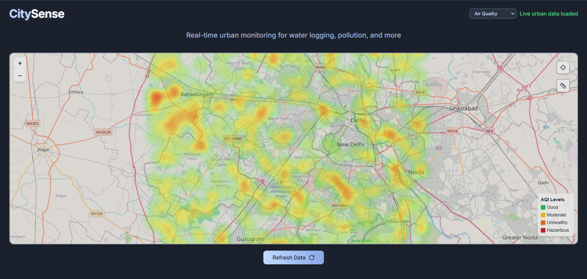
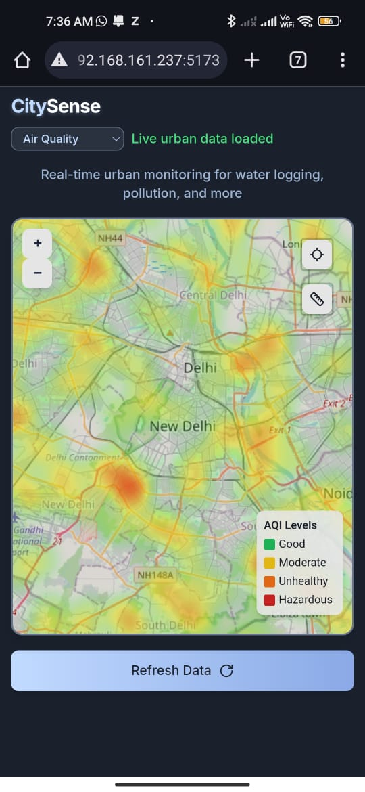
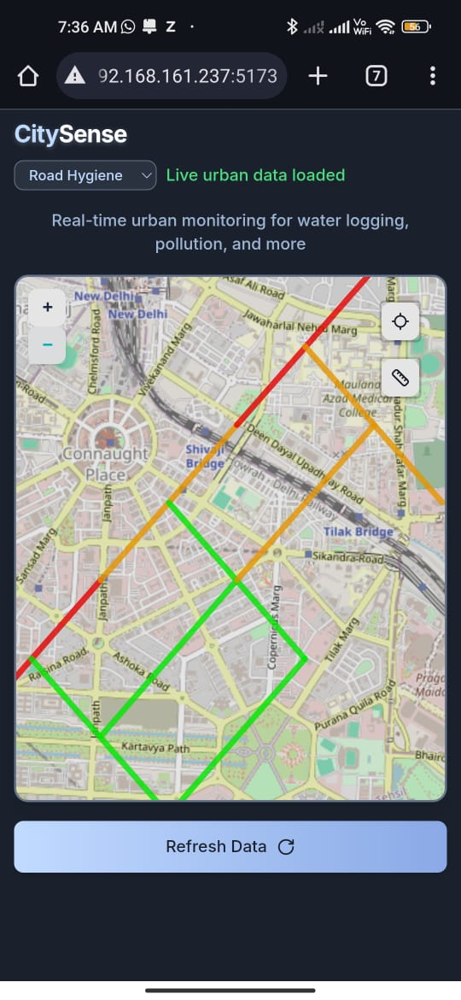
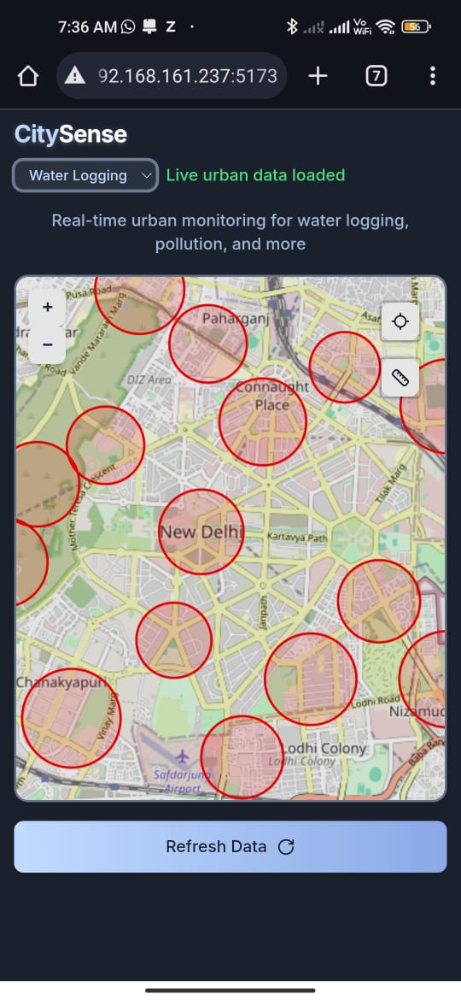

# CitySense - Smart Urban Monitoring System

**CitySense** is an innovative real-time urban monitoring solution designed to tackle pressing issues in cities like Delhi, including air pollution, potholes, waterlogging, and public hygiene. Developed by **Team InfiniteAura** during a hackathon, this project integrates IoT hardware, AI analytics, and a mobile application to deliver transparent, actionable urban data to citizens and authorities alike.

---

## Team
- **Swayam Bansal** (Team Lead)
- **Arun Kukrety**
- **Aniketh Anuraj**

---

## Problem Statement
Urban cities like Delhi face significant challenges due to:
- **Hygiene Levels**: Garbage overflow in areas like Chandni Chowk and Karol Bagh leads to health risks such as dengue and malaria outbreaks.
- **Air Pollution**: Delhi’s AQI frequently exceeds 400+ in winter, with hazardous levels in areas like Anand Vihar and RK Puram affecting public health.
- **Potholes & Damaged Roads**: In 2023, over 1,200 potholes were reported on roads like Outer Ring Road and ITO Bridge, causing accidents and safety concerns.
- **Flooded Roads**: Heavy rains in July 2023 flooded key areas like Minto Bridge and Connaught Place, resulting in massive traffic disruptions.

Despite government efforts, there’s a lack of real-time, accessible data for citizens to navigate these issues effectively. **CitySense** addresses this gap by providing a scalable, smart monitoring system.

---

## Solution: CitySense
CitySense offers real-time tracking of potholes, air pollution, road hygiene, and waterlogging using IoT and AI technologies.

### How It Works
1. **Data Collection**:
   - **Hardware**: 
     - **ESP32-CAM**: Captures images of road conditions.
     - **NEO-6M GPS**: Provides precise location data.
     - **MQ-135**: Measures air quality (pollution levels).
   - Sensors are deployed on roads or vehicles to collect real-time data.

2. **Data Transmission**:
   - Data is transmitted to the cloud via HTTP protocols for processing.

3. **Data Processing**:
   - **AI Analysis**: 
     - Processes road images to detect potholes.
     - Converts MQ-135 sensor readings into standardized AQI levels.
   - Cloud-based system aggregates and analyzes data in real time.

4. **Visualization**:
   - A mobile app displays urban conditions through heatmaps and metrics.
   - Current simulation includes:
     - **AQI**: 500 data points across Delhi.
     - **Road Hygiene**: 40 road segments spanning 6-17km each.
     - **Water Logging**: 15 non-overlapping zones with severity ratings.

### Mobile App Screenshots

#### Air Quality Monitoring

#### Road Hygiene Analysis

#### Water Logging Detection

---

  